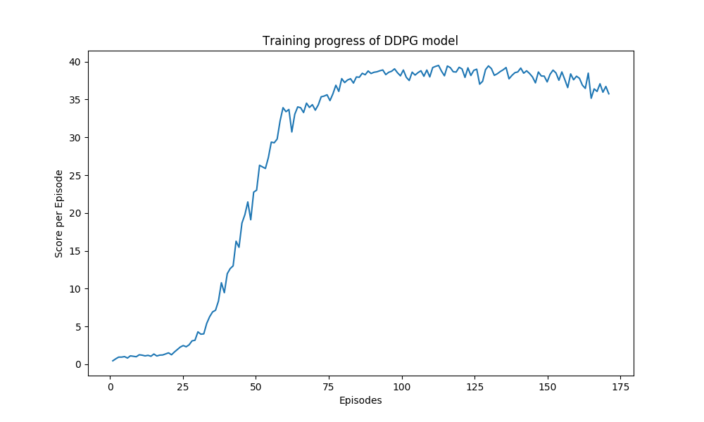

# Report

### Learning Algorithm
For this project, I used the `Deep Deterministic Policy Gradient (DDPG)` algorithm introduced by [Lillicrap et al (2015)](https://arxiv.org/abs/1509.02971). The implementation is based on the code in ddpg-bipedal code created by Udacity, but modified slightly to handle multiple simultaneous agents in the same environment.

#### DDPG Agent
- file: `agent.py`
- class: `ControlAgent`

The `DDPG` agent class is implemented, as described in the Deep Q-Learning algorithm. It provides several methods :
- **constructor** :
    - Initialize the memory buffer (Replay Buffer)
    - Initialize the actor (local, target) and the critic (local, target) models
- **step()** :
    Allows to store a step taken by the agent/agents (state, action, reward, next_state, done) in the Replay Buffer/Memory
    Every 10 steps, update (3 times) the critic and the actor networks. 
- **act()** returns actions (+ some small noise) for given state as per current policy.
- **learn()** Update policy and value parameters using given batch of experience tuples. Q_targets = r + γ * critic_target(next_state, actor_target(next_state))

#### Replay buffer
- file: `agent.py`
- class: `ReplayBuffer`

The ReplayBuffer class implements a fixed-size buffer to store experience tuples (state, action, reward, next_state, done)
- **add()** allows to add an experience step to the memory
- **sample()** allows to randomly sample a batch of experience steps for the learning

#### Network architecture

Both the actor and the critic models are a simple fully-connected DNN. After some experimenting, I found out that I have to add `nn.BatchNorm1d` layers to stabilize the learning. Without these additions, I could not solve the environment.

- file: `model.py`
- class: `ControlActorModel`

`ControlActorModel` is a simple fully-connected Deep Neural Network. The network has two hidden `nn.Linear` layers.

```
# ACTOR NETWORK
Batch Norm Layer

Fully Connected Layer(input_size=33, output_size=256)
Batch Norm Layer
ReLU

Fully Connected Layer(input_size=256, output_size=128)
Batch Norm Layer
ReLU

Tanh Activation() # outputs actions_size
```

- file: `model.py`
- class: `ControlCriticModel`

`ControlCriticModel` is a simple fully-connected Deep Neural Network. The network has three hidden `nn.Linear` layers.

```
# CRITIC NETWORK
Batch Norm Layer

Fully Connected Layer(input_size=33, output_size=256)
ReLU

Fully Connected Layer(input_size=256 + 33, output_size=256)
ReLU

Fully Connected Layer(input_size=256, output_size=128)
ReLU

Fully Connected Layer(input_size=128, output_size=1)

```

#### Hyperparameters
The **DQN agent** uses the following parameters values (defined in `agent.py`)
- **BUFFER_SIZE** = int(1e6)  # replay buffer size
- **BATCH_SIZE** = 1024       # minibatch size 
- **GAMMA** = 0.99            # discount factor 
- **TAU** = 0.001             # for soft update of target parameters
- **LR_ACTOR** = 1e-4         # actor learning rate
- **LR_CRITIC** = 3e-4        # critic learning rate 
- **LEARN_AFTER_EVERY** = 10  # Execute the learning after # of episodes
- **LEARN_ITER** = 3          # Execute the learning # of times

### Logs

#### Plot of rewards


#### Output log
```
Found path: /home/pestipeti/Work/Udacity/Nanodegrees/Reinforcement Learning/UdacityDRLContinuousControl/./Reacher_Linux/Reacher.x86_64
Mono path[0] = '/home/pestipeti/Work/Udacity/Nanodegrees/Reinforcement Learning/UdacityDRLContinuousControl/./Reacher_Linux/Reacher_Data/Managed'
Mono config path = '/home/pestipeti/Work/Udacity/Nanodegrees/Reinforcement Learning/UdacityDRLContinuousControl/./Reacher_Linux/Reacher_Data/MonoBleedingEdge/etc'
Preloaded 'ScreenSelector.so'
Preloaded 'libgrpc_csharp_ext.x64.so'
Unable to preload the following plugins:
        ScreenSelector.so
        libgrpc_csharp_ext.x86.so
Logging to /home/pestipeti/.config/unity3d/Unity Technologies/Unity Environment/Player.log
INFO:unityagents:
'Academy' started successfully!
Unity Academy name: Academy
        Number of Brains: 1
        Number of External Brains : 1
        Lesson number : 0
        Reset Parameters :
                goal_size -> 5.0
                goal_speed -> 1.0
Unity brain name: ReacherBrain
        Number of Visual Observations (per agent): 0
        Vector Observation space type: continuous
        Vector Observation space size (per agent): 33
        Number of stacked Vector Observation: 1
        Vector Action space type: continuous
        Vector Action space size (per agent): 4
        Vector Action descriptions: , , , 
Episode 1 average score: 0.45
Episode 2 average score: 0.71
Episode 3 average score: 0.94
Episode 4 average score: 0.94
Episode 5 average score: 1.01
Episode 6 average score: 0.82
Episode 7 average score: 1.10
Episode 8 average score: 1.04
Episode 9 average score: 0.99
Episode 10 average score: 1.25
     Last 100 episodes 10 average score: 0.92
Episode 11 average score: 1.20
Episode 12 average score: 1.10
Episode 13 average score: 1.17
Episode 14 average score: 1.05
Episode 15 average score: 1.35
Episode 16 average score: 1.09
Episode 17 average score: 1.20
Episode 18 average score: 1.22
Episode 19 average score: 1.36
Episode 20 average score: 1.50
     Last 100 episodes 20 average score: 1.08
Episode 21 average score: 1.25
Episode 22 average score: 1.62
Episode 23 average score: 1.95
Episode 24 average score: 2.27
Episode 25 average score: 2.47
Episode 26 average score: 2.31
Episode 27 average score: 2.56
Episode 28 average score: 3.09
Episode 29 average score: 3.17
Episode 30 average score: 4.28
     Last 100 episodes 30 average score: 1.55
Episode 31 average score: 3.97
Episode 32 average score: 4.01
Episode 33 average score: 5.40
Episode 34 average score: 6.28
Episode 35 average score: 6.91
Episode 36 average score: 7.14
Episode 37 average score: 8.35
Episode 38 average score: 10.78
Episode 39 average score: 9.46
Episode 40 average score: 11.97
     Last 100 episodes 40 average score: 3.02
Episode 41 average score: 12.64
Episode 42 average score: 13.00
Episode 43 average score: 16.26
Episode 44 average score: 15.45
Episode 45 average score: 18.66
Episode 46 average score: 19.76
Episode 47 average score: 21.46
Episode 48 average score: 19.10
Episode 49 average score: 22.75
Episode 50 average score: 23.01
     Last 100 episodes 50 average score: 6.06
Episode 51 average score: 26.30
Episode 52 average score: 26.09
Episode 53 average score: 25.88
Episode 54 average score: 27.31
Episode 55 average score: 29.36
Episode 56 average score: 29.28
Episode 57 average score: 29.77
Episode 58 average score: 32.18
Episode 59 average score: 33.92
Episode 60 average score: 33.39
     Last 100 episodes 60 average score: 9.94
Episode 61 average score: 33.68
Episode 62 average score: 30.71
Episode 63 average score: 33.04
Episode 64 average score: 34.02
Episode 65 average score: 33.91
Episode 66 average score: 33.27
Episode 67 average score: 34.52
Episode 68 average score: 33.95
Episode 69 average score: 34.32
Episode 70 average score: 33.59
     Last 100 episodes 70 average score: 13.30
Episode 71 average score: 34.28
Episode 72 average score: 35.36
Episode 73 average score: 35.45
Episode 74 average score: 35.62
Episode 75 average score: 34.85
Episode 76 average score: 35.75
Episode 77 average score: 36.88
Episode 78 average score: 36.07
Episode 79 average score: 37.76
Episode 80 average score: 37.24
     Last 100 episodes 80 average score: 16.13
Episode 81 average score: 37.58
Episode 82 average score: 37.75
Episode 83 average score: 37.17
Episode 84 average score: 37.98
Episode 85 average score: 37.94
Episode 86 average score: 38.47
Episode 87 average score: 38.27
Episode 88 average score: 38.77
Episode 89 average score: 38.44
Episode 90 average score: 38.60
     Last 100 episodes 90 average score: 18.57
Episode 91 average score: 38.67
Episode 92 average score: 38.80
Episode 93 average score: 38.91
Episode 94 average score: 38.29
Episode 95 average score: 38.60
Episode 96 average score: 38.74
Episode 97 average score: 39.05
Episode 98 average score: 38.54
Episode 99 average score: 38.13
Episode 100 average score: 38.90
     Last 100 episodes 100 average score: 20.58
Episode 101 average score: 37.94
Episode 102 average score: 37.51
Episode 103 average score: 38.61
Episode 104 average score: 38.23
Episode 105 average score: 38.56
Episode 106 average score: 38.80
Episode 107 average score: 38.07
Episode 108 average score: 38.90
Episode 109 average score: 37.99
Episode 110 average score: 39.22
     Last 100 episodes 110 average score: 24.33
Episode 111 average score: 39.38
Episode 112 average score: 39.51
Episode 113 average score: 38.75
Episode 114 average score: 38.13
Episode 115 average score: 39.43
Episode 116 average score: 39.21
Episode 117 average score: 38.67
Episode 118 average score: 38.63
Episode 119 average score: 39.26
Episode 120 average score: 39.04
     Last 100 episodes 120 average score: 28.11
Episode 121 average score: 37.92
Episode 122 average score: 39.19
Episode 123 average score: 38.17
Episode 124 average score: 38.86
Episode 125 average score: 39.01
Episode 126 average score: 37.03

====================================================================================================
Environment solved in 126 episodes. Average score of all agents over the last 100 episodes: 30.29
====================================================================================================

Episode 127 average score: 37.40
Episode 128 average score: 38.95
Episode 129 average score: 39.44
Episode 130 average score: 39.08
     Last 100 episodes 130 average score: 31.71
Episode 131 average score: 38.19
Episode 132 average score: 38.40
Episode 133 average score: 38.69
Episode 134 average score: 38.93
Episode 135 average score: 39.22
Episode 136 average score: 37.74
Episode 137 average score: 38.18
Episode 138 average score: 38.54
Episode 139 average score: 38.65
Episode 140 average score: 39.15
     Last 100 episodes 140 average score: 34.82
Episode 141 average score: 38.48
Episode 142 average score: 38.79
Episode 143 average score: 38.44
Episode 144 average score: 37.98
Episode 145 average score: 37.20
Episode 146 average score: 38.64
Episode 147 average score: 38.11
Episode 148 average score: 38.09
Episode 149 average score: 37.32
Episode 150 average score: 38.34
     Last 100 episodes 150 average score: 36.81
Episode 151 average score: 38.88
Episode 152 average score: 38.51
Episode 153 average score: 37.54
Episode 154 average score: 38.65
Episode 155 average score: 37.65
Episode 156 average score: 36.57
Episode 157 average score: 38.39
Episode 158 average score: 37.61
Episode 159 average score: 38.08
Episode 160 average score: 37.80
     Last 100 episodes 160 average score: 37.68
Episode 161 average score: 36.90
Episode 162 average score: 36.47
Episode 163 average score: 38.48
Episode 164 average score: 35.16
Episode 165 average score: 36.40
Episode 166 average score: 36.07
Episode 167 average score: 37.08
Episode 168 average score: 35.96
Episode 169 average score: 36.73
Episode 170 average score: 35.75
     Last 100 episodes 170 average score: 37.98

```

### Ideas for Future Work
- Improve the replay buffer. Currently being sampled with equal probability. There could be better results by making use of priorotized experience with the learning algorithm.
- Monitoring actor/critic losses. I suspect (I did not checke) there is a bit of overfitting. Learning rate decay could be a solution.
- Other learning algorithms could be used. Distributed Distributional Deterministic Policy Gradients (D4PG) has achieved state of the art results on continuous control problems.
